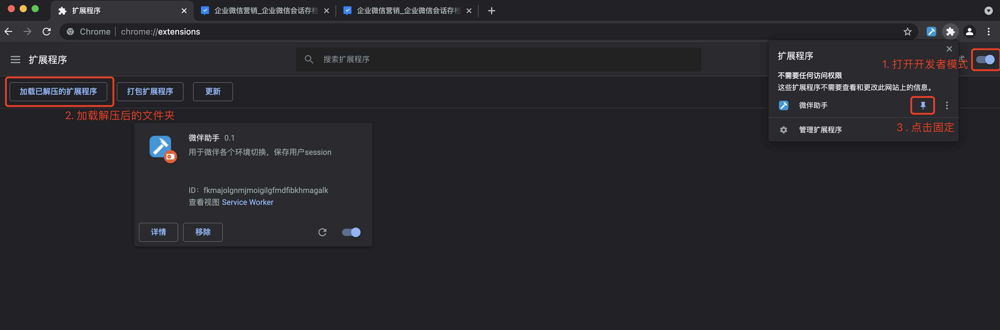
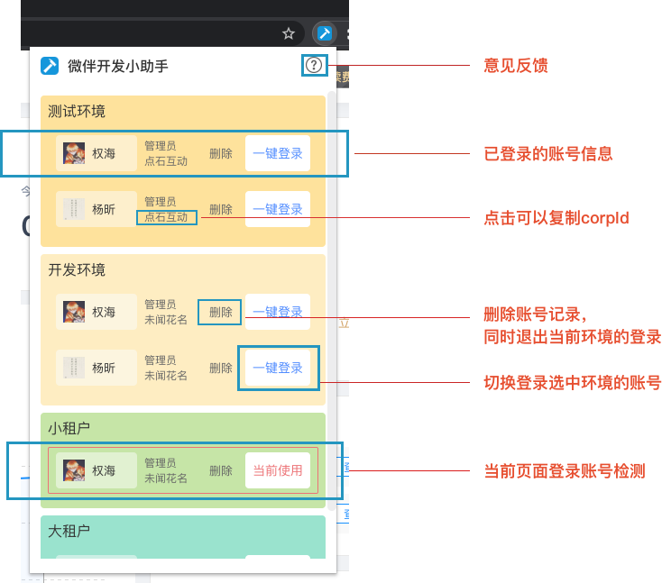

# 微伴开发小助手

## 主要用于存储历史登录用户个人信息，方便开发、测试

```
 npm i // 安装依赖
 npm run dev // 调试模式
 npm run build // 打包
```

### 如何调试：

1. 访问 [谷歌拓展](chrome://extensions/)
2. 打开右上角开发模式
3. 加载已解压的拓展程序 (./dist)

### 相关文档

- [Chrome Extensions](https://developer.chrome.com/docs/extensions/)
- [Vite](https://vitejs.bootcss.com/guide/)
- [React](https://zh-hans.reactjs.org/)


# 微伴开发小助手 - Chrome插件 - 使用指南


## 功能

1. 环**境和账号登录快速切换**, 如果没有记录需要`先手动登录`一次

2. 待开发...


## 支持的环境与账号

注意： 要使用环境/账号切换功能，需要是安装插件后登录对应账号或者刷新已登录页面

* 测试环境： dev.weibanzhushou.com 未闻花名
    * 任意账号
* 开发环境:  dev.weibanzhushou.com 点石科技
    * 任意账号
* 小租户： weibanzhushou.com 未闻花名
    * 任意账号
* 大租户： weibanzhushou.com 非未闻花名任意企业
    * 任意账号


## 安装

1. 下载最新版本的[压缩包](http://gitlab.yiban.io/innovation-team/we-work-development-tool/-/tags) 
2. 打开Chrome 扩展程序 - 开发者模式 
3. 点击加载已解压扩展程序， 使用解压缩后的文件夹
4. 打开扩展程序管理，点击固定


5. 每次更新插件，点击插件的`刷新`按钮


## 使用说明

* 微伴开发在localhost:1376 也可以使用哦, 可能需要修改winged.js


## 意见反馈
[意见反馈 - 点击提交issues](http://gitlab.yiban.io/innovation-team/we-work-development-tool/-/issues)


@创新组-夜莺科技
